# Chapter 1

> *Main Ideas:*
>
> - Two types of artificial neurons
>   1. The <u>perceptron</u>
>   2. The <u>sigmoid neuron</u>
> - <u>Gradient Descent</u>: standard learning algorithm for neural networks

### Perceptron

- Takes several binary inputs $x_1, x_2, ..., x_n$ and produces a single binary output

- We have wights $w_1, w_2, ...$ which are real numbers expressing the importance of the respective inputs to the output

  - Weights can vary in magnitude depending on their importance. Bigger weights mean the input has more relevance over the others

  - Output of 1 or 0 is determined by the weighted sum being less than or greater than a **threshold value**

>
>
>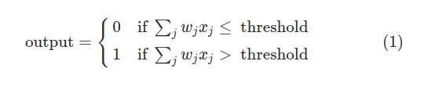
>
>
>
>$$
>\sum_j w_jx_j = w \cdot x
>$$
>
>- The latter just means that we can write the sum as the sum of the dot product of two vectors. $w$ being the vector with weights and $x$ being the vector with inputs
>- We also move the threshold or **bias** to the other side of the inequality and have $b = -threshold$
>
>
>
>

- The **bias** is the measure of how easy it is to get the perceptron to fire
  - *high* bias means its really easy for the perceptron to output a 1
  - *low* bias (or really negative one) means its hard to output a 1

- We can also emulate XOR gates (which are logically complete). Here $w_n = -2 $, and we use it to add two bits:

  

- Now let's take a step further which can automatically tune the weights and biases of a netwrok of artificial neurons. Happens in response to external stimuli, without direct intervention by a programmer

### Sigmoid Neurons

- Now what we want is a network to do small changes in weight (or bias) to cause only small corresponding change in the output from the network. 
  - **Problem**: One challenge is that any single change may cause the output of the preceptron to abruptly flip from 0 to a 1 if we change weights or biases. That can really alter our behavior

- For this reason we introduce the **sigmoid neuron**. It can now take values from 0 to 1 as their input (for instance 0.638). 

  - We still keep our weights and our biases

  - Output now becomes:
    $$
    \begin{gather}
    \sigma(z) = \frac{1}{1+e^{-z}} \\\\
    \text{Or more explicitley:} \\\\
    \frac{1}{1+exp(-(w\cdot x) - b)}
    \end{gather}
    $$

- We notice that for really big $z = w \cdot x +b $ our $e^{-z}$ just goes to 0, which means our sigmoid function $\sigma(z)$ turns into a 1
- For really negative $z = w\cdot x + b$, our $e^{-z}$ just turn wildly big, hence our sigmoid function $\sigma(z)$ approaches 0 

> **Sigmoid function smoothness vs. the discrete step function of perceptrons**
>
> 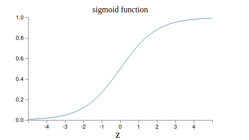
>
> 
>
> 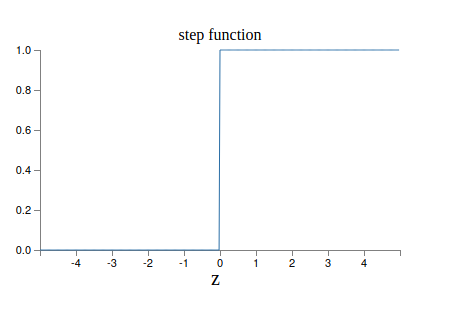
>
> - The smoothness of *σ* means that small changes $Δw_j$ in the weights and $Δb$ in the bias will produce a small change Δoutput in the output from the neuron. This is shown by the derivative:
>
>   - Partial derivatives that show the change with respect to $w_j$ and $b$ respectively 
>
>   
>
>   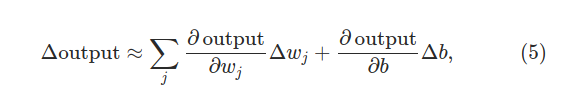
>
>   
>
> - Δoutput is a **linear function** of the changes $Δw_j$ and *Δb* in the weights and bias.  This linearity makes it easy to choose small changes in the weights and biases to achieve any desired small change in the output.  

- **Remark**:
  - Why do we use the sigmoid function for these changes? As a matter of fact we can use any function such that $f(w \cdot x + b)$ for some other **activation function**
  - The main thing that changes when we use a different activation function is that the particular values for the partial derivatives in the equation change

#### Exercise 1

- **Sigmoid neurons simulating perceptrons, part I**  
  Suppose we take all the weights and biases in a network of  perceptrons, and multiply them by a positive constant, *c*>0.  Show that the behaviour of the network doesn't change.

- **Sigmoid neurons simulating perceptrons, part II**   
   Suppose we have the same setup as the last problem - a  network of perceptrons.  Suppose also that the overall input to the  network of perceptrons has been chosen.  We won't need the actual  input value, we just need the input to have been fixed.  Suppose the  weights and biases are such that *w*⋅*x*+*b*≠0 for the  input *x* to any particular perceptron in the network.  Now replace  all the perceptrons in the network by sigmoid neurons, and multiply  the weights and biases by a positive constant *c*>0. Show that in  the limit as $c→∞$ the behaviour of this network of  sigmoid neurons is exactly the same as the network of perceptrons.  How can this fail when $w⋅x+b=0 $for one of the  perceptrons?

### The architecture of neural networks

- Leftmost layer are called **input neurons**
- Rightmost layer (output layer) contains the **output neurons**. In this case we have only one
- Middle layers is called the **hidden layer** (meaning not an input or an output)
- Confusingly, such multiple layer networks are sometimes called **multilayer perceptrons** or **MLP's**, despite being made of sigmoid neurons
- For number processing of images, we should encode the intensities of the image pixels into the input neurons.
  - If the image is a 64 by 64 greyscale image, then we'd have 4,096=64×64 input neurons, with the intensities scaled appropriately between 0 and 1.
  -  The output layer will contain just a single neuron, with output values of less than 0.5 indicating "input image is not a 9", and values greater than 0.5 indicating "input image is a 9 "
- Input and output layers are generally easy to design, but hidden layer neurons usually rely on design heuristics 
- Networks where the output layer is used as input to the next layer are called **feedforward** neural networks - no loops in the network, information is always fed forward
  - Recurrent neural networks can be good to use the output as the input of the network

### Simple network to classify handwritten digits

- Our aim is to classify single digits by modeling this network:

  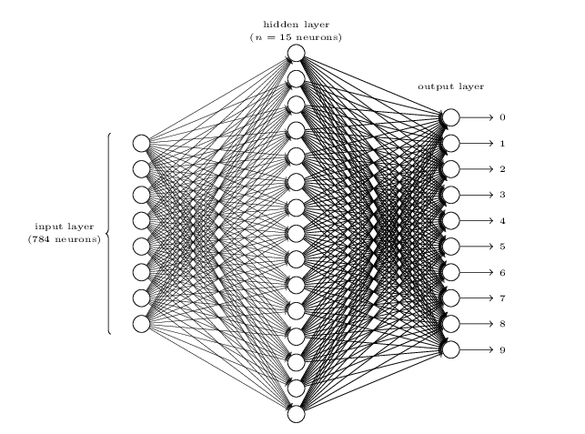

- The input layer of the network contains neurons encoding the values of the input pixels. Our training data for the network will consist of many 28 by 28 pixel images of scanned handwritten digits, and so the input layer contains 784=28×28 neurons
  -  The input pixels are greyscale, with a value of 0.0 representing white, a value of 1.0 representing black, and in between values representing gradually darkening shades of gray

#### Exercise

- There is a way of determining the bitwise representation of a  digit by adding an extra layer to the three-layer network above.  The extra layer converts the output from the previous layer into a  binary representation, as illustrated in the figure below.  Find a  set of weights and biases for the new output layer.  Assume that the  first 3 layers of neurons are such that the correct output in the  third layer (i.e., the old output layer) has activation at least  0.99, and incorrect outputs have activation less than 0.01.

### Learning with gradient descent

- Each image is a 28 x 28 = 784-dimensional vector, and each entry on the entry represents the gray value for a single pixel in the image

  - We'll denote the corresponding desired output by $y=y(x)$, where $y$ is a 10-dimensional vector

- What we'd like is an algorithm which let us find weights and biases so that the output from the the network approximates $y(x)$. To quantify how well we're achieving this goal we use a **cost function**:

  >**Quadratic Cost Function** (or Mean Squared Error a.k.a MSE )
  >
  >
  >$$
  >C(w, b) = \frac{1}{2n}\sum_x ||y(x) - a||^2
  >$$
  >- $y(x)=(0,0,0,0,0,0,1,0,0,0)^T$, if we want a 6 for example
  >- $w$ denotes the collection of all wights in the network
  >- $b$ denotes all biases
  >- $n$ is the total number of training inputs 
  >- $a$ is the vector of outputs (dependent on $w$, $n$, and $b$)
  >  - $a$ is simply the result from that image $x$ used in the instance
  >
  >
  >
  >We notice that function is always positive, and it a<u>pproaches 0 when $y(x)$ is approximately equal to the output</u> $a$ for all training inputs $x$.  The larger it is, the more far-off we are from the actual result we *expect*
  >
  >*Main goal:* Minimize cost $C(w,b)$ as a function of the weights and biases. How? <u>Gradient descent</u> is our answer baby!
  >

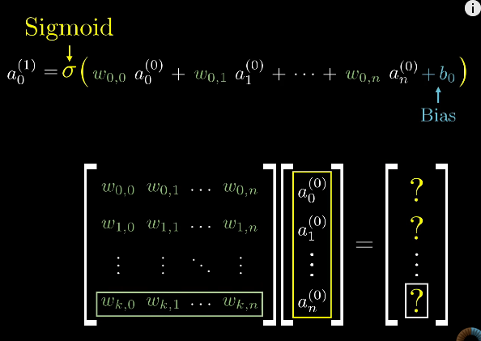

- Before moving on, this is our goal:
  1. find weights and biases which minimize the quadratic cost function $C(w, b)$
  2. For the goal above, we use gradient descent to reach a local minima of the function

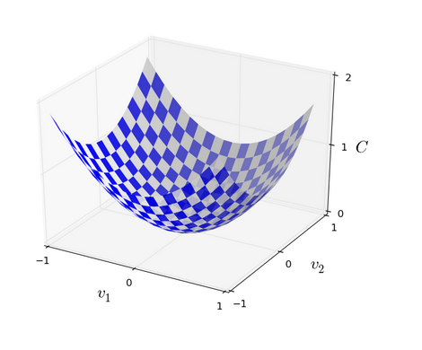

- For this, we imagine a ball rolling down that should approximate the bottom of this valley. If we have two variables $v_1$ and $v_2$ as shown above, if we want to move the ball in direction of $v_1$ and $v_2$ we look at calculus. $C$ changes as follows:

  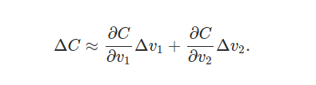

  - We will have to chose $\Delta v_1$ and a $\Delta v_2$ so as to make $\Delta C$ negative (so we roll down the valley)

    

> - To help find the choice of changes, we define $\Delta v$ to be the vector of changes in $v$,
>
>   - $\Delta v = (\Delta v_1, \Delta v_2)^T$
>   - We'll also define the *gradient* of $C$  ($\nabla C$)to be the vector of partial derivatives. We denote the gradient vector by $\nabla C$:
>
>   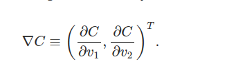
>
>   
>
> - Now with that we have defined $\nabla C$, we can now write the change of C ($\Delta C$) as follows. We notice that $\nabla C$ related changes in $v$ in $C$:
>
>   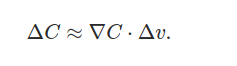
>
>   
>
> - How do we go down our gradient then? Well quite simply, we can define out change vector $\Delta v$ as follows:
>
>   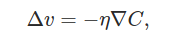
>
>   - $\eta$  is a small, positive parameter (known as the *learning rate*)
>
>   - This equation defines the **"law of motion"** of out imaginary gradient descent ball
>
>     
>
> - From previous equation we can derive the following:
>
>   
>   $$
>   \begin{gather}
>   \Delta C = \\ -\eta \nabla C \cdot \nabla C = -\eta||\nabla C||^2
>   \end{gather}
>   $$
>   
>
>   - Because $||\nabla C||^2 \ge 0$ this grantees that $\Delta C \le 0$, hence we are always <u>descending!</u>
>
>   
>
> - If we take the above equation for $\Delta v$, we can then move <u>our ball's position $v$</u> by that amount:
>
>   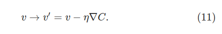
>
>   - Or our current $v'$ equals $v$ minus change in $v$

- How it works:
  1. Calculate the gradient $\nabla C$ at the point
  2. Move in the opposite direction with the derivations above
  3. Update our "ball" position v
  4. Repeat 
- This obviously generalizes for the case of hundreds in our gradient vector.  It gives us a way of repeatedly changing the position $v$ in order to find a minimum of the function $C$

___

- How can we apply gradient descent to learn in a neural network?

  - Idea is to use gradient descent to find the weights $w_k$ and biases $b_l$ which minimize the cost equation we saw above:
    $$
    C(w, b) = \frac{1}{2n}\sum_x ||y(x) - a||^2
    $$
    
  - Our "position" now has components $w_k$ and $b_l$: 
  
    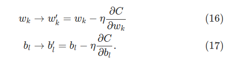
  
- We still have an issue to affront. If we look at the cost function, we see that its a <u>sum of the amount of error for each image</u>. This means that if we have $x$ number of images, we need to compute $\nabla C_x$ separately for each training input and then average them:

  - This means: 
    $$
    \nabla C = \frac{1}{n}\sum_x\nabla C_x
    $$
    

    - This is expensive, to solve this we can do **stochastic gradient descent**
    - Idea is to estimate the gradient $\nabla C$ by computing a small samples of $\nabla C_x$ for a small sample of randomly chosen input
    - This let's us calculate (or approximate) the true gradient $\nabla C$

- **Stochastic gradient descent** uses the law of large numbers with random variables $X_1, X_2, ..., X_m$. Provided the sample size $m$ is large enough we expect that the average value of $\nabla C_{X_j}$ will be roughly equal to the average over all $\nabla C_x$, that is:

  
  $$
  \begin{gather}
  \frac{\sum^m_{j=1}\nabla C_{X_j}}{m} \approx \frac{\sum_x \nabla C_x}{n} = \nabla C \\ \\
  \nabla C \approx \frac{1}{m}\sum^m_{j=1} \nabla C_{X_j}
  \end{gather}
  $$
  
- From the above derivations, we know the following now by picking a mini-batch of training input:

  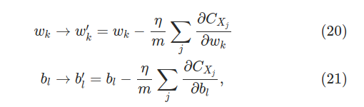 

- Of course our estimates won't be perfect, but it doesn't need to be perfect: all we really care about is that we are moving in a general direction that will help decrease $C$. 

### Implementing our Network to classify digits

- How to we apply our weights and biases? We use our sigmoid function:

  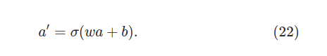

  - To get $a'$ (or the resulting output of the neuron), the function does the following:

    - $W$ is the set of weights of the layer of neurons
    - $a$ is the vector of activations from the previous layer of neurons
    - $b$ is the vector of biases of the neurons of that layer
    - Then we apply $\sigma$ function to each entry in the vector $Wa+b$  (*vectorizing* the function $\sigma$)
    - For the next layer, the vector output of $\sigma(Wa+b)$ will be $a'$

    
    
    

