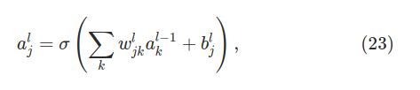
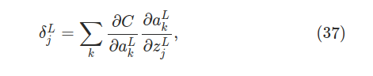

# Chapter 2 - Back propagation

[TOC]

### Fast Matrix-based approach to computing the output from neural network

- Let's us begin with the notation which lets us refer to weights in the network in an unambiguous wa

  > - $w^l_{jk}$ is used to denote the wight for the connection from the $k^{th}$ neuron in $(l-1)^{th}$ layer in the $j^{th} $ neuron in the $l^{th}$ layer. 
  >
  > - Diagram below shows the weight on a connection from the fourth neuron in the second layer to the second neuron in the third layer of the network:
  >
  >   
  >
  >   
  >   $$
  >   W^3 = 
  >   \begin{pmatrix}
  >   w_{11} & w_{12} & w_{13} & w_{14} \\
  >   w_{21} & w_{22} & w_{23} & w_{24} 
  >   \end{pmatrix}
  >   $$
  >   
  >
  >   
  >- We use similar notations for network's biases and activations:
  > 
  >  - We use the $b_j^l$ to refer to the <u>bias</u> in the $j^{th}$ neuron in the $l^{th}$ layer 
  >   - We use $a^l_j$ for the activation in the $j^{th}$ neuron in the $l^{th}$ layer
  > 
  >  
  > 
  >- So if we are concerned in knowing the activation of a certain neuron we can calculate it as such:
  > 
  >  
  > 
  >  - So we do the weight of $k^{th}$ times the activations of the 
  >   - Even better is to write this in matrix form, where $j$ is a constant (the weights that point to the neuron of interest):
  > 
  > $$
  >   a^l_k = \sigma(w^l_{jk} a^{l-1}_k+b^l_j)
  > $$
  > 
  >  - Or the even more beautiful and compact vectorized form. Vector $a^l$ has all activations of the layer, hence you simply go down the rows if you want to know the activation. Better than the neuron-by-neuron view:
  > 
  >    
  > 
  >  - We usually write the intermediate quantity as vector. This we call **weighted input** to the neuron layer $l$:
  >     $$
  >     \begin{gather}
  >     z^l = w^la^{l-1}+b^l \\\\
  >     a^l = \sigma(z^l)
  >     \end{gather}
  >     $$

### The two assumptions we need about cost function

- Goal of backpropagation is to <u>compute the partial derivatives</u> $∂C/∂w$  and $∂C/∂b$ of the cost function C below with respect to any weight *w* or bias *b* in the network

  > 
  >
  > 
  >
  > - $n$ is total number of training examples
  > - The sum is over individual training examples $x$
  > - $y=y(x)$ is the corresponding desired output
  > - $L$ denotes the number of layers in the network
  > - $a^L = a^L(x)$ is the vector of activations output from the network when $x$ is input

  ___

- So now that we know our actual cost function what assumptions do we need to $C$ in order that back propagation can be applied?
  1. <u>Cost function can be written as an average</u> $C = \frac{1}{n}\sum_x C_x$ over cost cost function $C_x$ for individual training examples $x$
     
     - This is case for the quadratic cost function, where cost for a single training example is $C_x = \frac{1}{2} ||y-a^L||^2$ 
     - This assumption is necessary because *backpropagation* actually lets us compute the partial derivatives $\partial C_x/\partial w$ and $\partial C_x/\partial b$ for a single training example, and then average it over training examples  to get   $\partial C/\partial w$ and $\partial C/\partial b$ 
     
  2. It can be written as a function of the outputs from the neural network:
  
     - 
  
     - Quadratic cost function satisfies this since:
  
       

### The Hadamard Product, $s \bigodot t$

- Suppose $s$ and $t$ are two vectors of the same dimension. The we use $s \bigodot t$ to denote the *elementwise* product of the two vectors

  

- We commonly know this as **Handamard product**

  - Takes two matrices of the same dimensions and produces another matrix of the same dimension as the operands where each element $i$, $j$ is the product of elements $i$, $j$ of the original two matrices.

### The four fundamental equations behind Backpropagation

- Backpropagation is about understanding how changing the weights and biases in a network changes the cost function
  - This ultimately means computing the partial derivatives $\partial C / \partial w^l_{jk}$ and $\partial C / \partial b^l_j$. 
  - For that we also use an intermediate quantity $\delta^l_j$ which we call the <u>error</u> in the $j^{th}$ neuron in the $l^{th}$ layer. 
  - Backpropagation will give us a procedure to <u>compute the error</u> $\delta^l_j$, and then will relate $\delta^l_j$ to $\partial C/ \partial w^l_{jk}$ and $\partial C/ \partial b^l_j$. We will define $\delta^l_j$ by the equation below; error of neuron $j$ in layer $l$:

- What is the intuition for the equation above? 
  - We add/subtract a little change to $\Delta z^l_j$ to the neurons weighted input, so that instead of outputting  $\sigma(z^l_j)$, the neuron instead outputs $\sigma(z^l_j + \Delta z_j^l)$/
  - This change propagates through the network finally causing the overall cost to change by amount $\partial C / \partial z^l_j \times \Delta z^l_j$ 
  - If  $\partial C / \partial z^l_j$ has a large value, then we can lower cost by choosing $\Delta z^l_j$ to have an opposite sign to  $\partial C / \partial z^l_j$
    - Remember that this gradient has some value for the input space, and we can measure its magnitude
  - If $\partial C / \partial z^l_j$ its *close to zero we cant really do much*, the neuron is close the the "optimal" of its output
  - There is a <u>heuristic sense</u> in which $\partial C / \partial z^l_j$  is a measure of the error in the neuron
  - $\delta^l$ is the <u>vector of errors</u> associated with layer $l$

#### Cost function and Activation function

Activation function:
$$
\begin{gather}
\sigma(z) = \frac{1}{1+e^{-z}} \\\\
\text{Or more explicitley:} \\\\
\frac{1}{1+exp(-(w\cdot x) - b)}

\\\\
\text{where w = weights, x = input and b = bias}
\end{gather}
$$

Cost function:

$$
C =\frac{1}{2} \sum_j(y_j-a^L_j)^2
\\\\
\text{where y_j and } a^L_j \text{ can be interpreted as vector outputs}
$$

#### 1. An equation for the Error in the output layer: $\delta^L$

> 
>
> - $\partial C / \partial a^L_j$ measures how fast the cost is changing as a function of the $j^{th}$ output of activations
>   - If $C$ doesn't depend much on a particular output neuron $j$ then $\delta^L_j$ will be small
>   - We note that the derivative of $C =\frac{1}{2} \sum_j(y_j-a^L_j)^2$ is: 
>     - $\partial C / \partial a^L_j = (a^L_j - y_j)$
> - $\sigma'(z^L_j)$ measures how fast the activation function $\sigma$ is changing at $z^L_j$ 
>   - Recall that when $\sigma'(z^L)$ is close to 0 or 1,  $\sigma'(z^L) \approx 0$. So weights in final layer will learn slowly if the output neuron is low activation or high activation
>     - Output neuron is *saturated*, hence weight has stopped learning (or slowly)
>
> In matrix based form we would write it like this:
>
> 
>
> Which we can even compress more:
>
> 
>
> - $\nabla_a C$ is a vector whose components are the partial derivatives $\partial C / \partial a^L_j$ 
> - $\nabla_a C$ expresses the rate of change of $C$ with respects to the output activations

#### 2. An equation for the error $\delta^l$ in terms of the error of the next layer $δ^{l+1}$: 

> 
>
> - $(w^{l+1})^T$ is the transpose of the weight matrix for the $(l+1)^{th}$ layer
>   - If we know $\delta^{l+1}$ at the $(l+1)^{th}$ layer, then the intuitive interpretation of vector product with $(w^{l+1})^T$ will we *moving the error backwards through the network*
>   - If we sketch out, we are multiplying the error by its corresponding neuron in $(l+1)^{th}$
>   - Gives us some sort of measure of the error at the output of the $l^{th}$ layer
> - Then we apply $\sigma'(z^l)$ which moves the error backwards through the activation in layer $l$
>   - We also note that saturation affects $BP2$ unless the first part of the equation is big enough
>
> **IMPORTANT**
>
> - Equation $BP1$ and $BP2$ is at the heart of back propagation since helps us compute the error $\delta^l$ for any layer in the network
>   - We first use $BP1$ to calculate the error at the output layer
>   - Then use $BP2$ to compute $\delta^{L-1}$, then $\delta^{L-2}$ and so on for $\delta^{L-n}$

#### 3. An equation for the rate of change of the cost with respect to any bias in the network

> 
>
> - That is, the error $\delta^l_j$ is *exactly equal* to the rate of change $\partial C/ \partial b^l_j$ 
>
>   - With $BP1$ and $BP2$ we can already find $\delta^l$ for any $l$
>   - When output neuron is saturated, we also realize that our change is affected here as well since we know  $\delta ^l_j$ depends on $BP1$ and $BP2$ 
>
> - Shorthand:
>
>   - From here its understood that $\delta$ is being evaluated at the same neuron as bias $b$
>
>   

#### 4. An equation for the rate of change of the cost with respect to any weight in the network

> 
>
> - This tells us how to compute the partial derivatives $\partial C/ \partial w^l_{jk}$ in terms of quantities $\delta^l$ and $a^{l-1}$ which we already know how to compute.
>
>   - A consequence of this is that when $a_{in} = 0$ the gradient will also be small. This means weights learns slowly during gradient descent. 
>   - Another consequence is that <u>weights output from a low-activation neurons learn slowly</u> 
>
> - Can also be expressed as
>
>   
>
> - If we take a look inside this is whats happening:
>
>   
>
>   

**General Remark:**

- A weight will learn slowly if either the <u>input neuron is low-activation</u> (case in equation 4), or if <u>output neuron is is saturated</u> (case in all equations)

- These four fundamental equations hold for any activation function, not just the standard sigmoid function

- These functions above can be interpreted in terms of matrices rather than Hadamard product (Hadamard is faster to implement in code):

  Note: $\sum'(z^L)$ is a square matrix with diagonals $\sigma'(z_j^L)$

  - $BP1:$

    

  - $BP2:$

    

    

- Note that if we want to know the error at layer $l$ we can propagate it backwards with the equation below. Note that its written with the matrix form:

  

  

### Proof of the four fundamental equations (optional)

Remembering these things help:
$$
\begin{gather}
C =\frac{1}{2} \sum_j(y_j-a^L_j)^2 \\\\
\partial C / \partial a^L_j = (a^L_j - y_j) \\\\
z^{(L)} = w^{(L)}a^{(L-1)} + b^{(L)} \\\\
a^{(L)} = \sigma(z^{(L)}) \\\\
\partial a^L / \partial z^L = \sigma'(z^L)

\end{gather}
$$

**Proof of first equation:**

- Here we notice that the activation of the a neuron will be 0 unless k = j (the activation of that actual neuron)

**Proof of second equation**

- First we want to rewrite $\delta^l_j = \partial C/\partial z^l_j$ in terms of $\delta^{l+1}_k = \partial C/\partial z^{l+1}_k$. Notice that the current error now depends on the error of layer $l+1$

- Now to evaluate the first term in the last line (42):

  

- Now taking that result with the second term in line (42), we can rewrite:

  

**Proof of last two:**

These are proofs on the rougher side:
$$
\begin{gather}
\partial C/\partial w^{(L)} = \frac{\partial z^{L}}{\partial w^{(L)}} \frac{\partial a^{L}}{\partial z^{(L)}} \frac{\partial C^{}}{\partial a^{(L)}}

\\\\

\partial C/\partial b^{(L)} = \frac{\partial z^{L}}{\partial b^{(L)}} \frac{\partial a^{L}}{\partial z^{(L)}} \frac{\partial C^{}}{\partial a^{(L)}}
\end{gather}
$$

### Backpropagation Algorithm

- The algorithm is the following:

  

- The above calculates the cost function for a single training example. In practice we do this with **SGD**, which means that we calculate an average error with a mini batch. This means that we approximate the gradient in practice: 

  - 

  - So for each picture in our mini batch we do the feed forward, output the error and back propagate the error 

  - Then we update the <u>weights</u> of each layer according to the gradient we derived:

    - For weights in the $l^{th}$ we sum all errors for each activation of the previous layer and average it out (then multiply by our eta)
    - <u>Note</u>: we transpose so that we multiply the error with the exact neuron

  - Then we update the <u>bias</u> according to the gradient we derived:

    - Sum all errors of the $l^{th}$ layer for each picture and average it out (then multiply by our chose eta)

      

