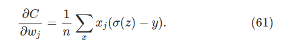
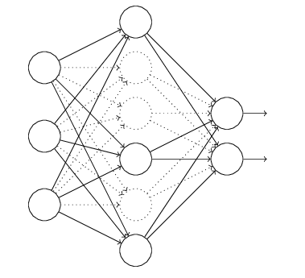
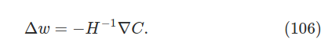

# Chapter 3 - Improving the way they learn

[TOC]

We will now work to improve our basic swing of golf (our original implementation). To do so we will use the following techniques:

- Better choice of cost function, known as the <u>cross-entropy</u> cost function
- Using four <u>"regularization" methods</u>. This makes our network better at generalizing beyond the training data:
  - *L1* and *L2* regularization
  - *Dropout*
  - *Artificial expansion* of training data

- A better method for initializing the weights in the network
- A set of heuristics to help choose good hyper-parameters

### Cross-Entropy cost function

- One would assume that when the neuron is way off that it could correct itself quicker, but this is far from what it actually does. We have to realize that the more off it is, the longer it takes to correct itself

  - Here we can see it below. If our neuron weight and bias start at 2, our initial output $a(z) = 0.98$. From the animation we notice it takes <u>a lot of time</u> to finally correct itself (with a learning rate of $\eta = 0.15$)

  

- Let's go deeper into this problem by calculating the gradients:

  > - We use the quadratic cost function for 1 neuron. So our cost $C$ will be:
  >
  > $$
  > C = \frac{(y-a)^2}{2}
  > $$
  >
  > - Now lets calculate the derivatives where training input $x = 1$ is used and $y=0$ is desired output. Remember $a = \sigma(z)$, where $z = wx + b$. We use the chain rule:
  >
  >   
  >
  > - So now that we have all this material why does this move so slowly? If we look closely at our $\sigma^{\prime}(z)$ we see that when the value is very high, its rate of change approaches 0:
  >
  >   
  >
  >   - So our $\partial C/ \partial w$ and our $\partial C/ \partial b$ get very very small, and this shows the origin of the <u>slowdown</u> in learning.

#### Introducing the cross-entropy cost function

- We can solve the issue seen above by replacing our quadratic cost function by the known <u>cross-entropy function</u>

- We will apply it to this example:

  

  

  - We remind ourselves that $a = \sigma (z)$, where $z = \sum_j w_jx_j+b$. The <u>cross-entropy function</u> for this neuron will be:

    >
    >
    >- $n$ is the total number of items of the training data
    >
    >- Sum is over all training inputs $x$ and $y$ is corresponding desired output
    >
    >- Two properties make it reasonable to interpret the cross-entropy as a cost function. They show that cross-entropy is positive and tends towards zero as the neuron get better at computing the desired output $y$:
    >
    >  1. *Its non-negative,* that is $C > 0$. 
    >- All individual terms in the sum are negative, since both logarithms are numbers that range 0 to 1
    >     - There is a minus sign in front of the sum
    >     
    > 2. If neuron's actual output is *close to desired output* for all training inputs, $x$, then the cross-*entropy will be close to zero.*
    > 
    >    - E.g. if $y=0$ and $a \approx 0$ we see that stuff vanishes
    >     - E.g. if $y=1$ and $a \approx 1$ stuff also vanishes
    > 
    

- So why would you prefer this over our regular cost function? Well it has the benefit that, unlike the quadratic cost, it avoids the problem of learning slowing down. Let's compute the partial derivatives to see this:

  

  

  - What do they tell us?

  - Well it tells us that the rate at which the wight (and the bias) learn is controlled by $\sigma(z) -y$. The larger the error the <u>faster</u> the neuron will learn!

  - Cross-entropy was *designed* to exhibit this kind of behavior

  - Result with a learning rate of $\eta = 0.005$:

    

    - when we use the quadratic cost learning is *slower* when the neuron is unambiguously wrong than it is later on, as the neuron gets closer to the correct output
    - with the cross-entropy learning is faster when the neuron is unambiguously wrong.

- Now let's generalize the cross-entropy to many-neuron multi-layer network. 

  - Suppose $y = y_1, y_2, ...$ are desired values of output neurons

  - Suppose $a^L_1, a^L_2 ...$ are the actual output values. Then we define cross entropy by:

    

    - For each activation (input x), calculate the cross entropy at neuron $j$ from its expected $y$
    - You can think of (63) as a summed set of per-neuron cross-entropies, with the activation of each neuron being interpreted as part of a two-element probability distribution. So its a generalization of the cross-entropy for probability distribution
  
- **Note:**
  $$
  \sigma'(z) = \sigma(z)(1-\sigma(z))
  $$
  

#### Softmax

- Idea of the <u>softmax</u> is to define a new type of output layer for our neural networks. It begins the same way as with a sigmoid layer by forming weighted inputs:

  - $$
    z^L_j = \sum_k w_{jk}^L a_k^{L-1} + b_j^L
    $$

- However we don't apply the sigmoid function to get the output. Instead, in a softmax layer we apply the so-called ***softmax* function** to the $z_j^L$. According to this function, the activation $a^L_j$ of the $j$th output neuron is:

  - $$
    a_j^L = \frac{e^{z^L_j}}{\sum_k e^{z^L_k}}
    $$
  
- It's really good for fast learning since if you have an outlier firing ($z_4^L$) it will decrease the activation of the other neurons, while subsequently increasing its activation. The total change in $a^L_4$ exactly compensates for the change in $a_4^L$

  

  

  > The reason is that the output activations are guaranteed to always sum up to 1. This can be shown with this little equation below:
  >
  > 
  >
  > - Things to notice: the output activations are all positive, since the exponential function is positive
  > - We notice that the softmax layer is a set of positive numbers which sum up to 1. In other words, we can think of it as a *probability distribution*
  > - We can then interpret this as the output activation $a^L_j$ as the network's estimate of the probability that the correct output is $j$  
  >   - For MNIST classification, we can interpret $a^L_j$ as the networks estimated probability that the correct digit classification is $j$
  > - You can think of softmax as a way of rescaling the $z^L_j$ and then squishing them together to form a probability distribution.

#### The learning slowdown problem with Soft Max

> - We are yet to see how a *softmax* layer lets us address the learning slowdown problem. To understand it, let's define the *log-likelihood* cost function:
>
>   
>
>   - $x$ denotes a training input to the network 
>
>   - $y$ denotes the corresponding desired output
>   
> - So if we have an input image of $7$, the log-likelihood cost is $-ln(a_7^L)$. How do we interpret it?
>
>   - If our network believes it's a $7$, it will estimate a value for the corresponding probability $a^L_7$ which is close to 1. Then the cost $-ln(a_7^L)$ will be small
>   - When the network is sucking the probability $a^L_7$ will be smaller and the cost $-ln(a^L_7)$ will be larger
>
> - What about the learning slowdown? Well when we are *concerned with learning slowdown*, the quantities that we are mostly concerned with are $\partial C / \partial b^L_j$ and $\partial C / \partial w^L_{jk}$. The derivatives of the above are the following:
>
>    
>
>   - Notice that this equations are analogous to our earlier analysis of cross-entropy!
>   - Useful to think of the softmax output layer with the log-likelihood cost as being quite similar to a sigmoid output layer with cross entropy

- So which one should we choose - the cross-entropy or the softmax output layer?
- Softmax is usually worth using to interpret output as as probabilities

### Overfitting and regularization

- Fermi: "I remember my friend Johnny von Neumann used to say, with four parameters I can fit an elephant, and with five I can make him wiggle his trunk."

  - Quote says that any complex model can fit almost any data present, even if the model agrees the the available data (there is enough freedom in the model to describe the phenomenon).
  - When this happens the model will succeed with the data, but will fail to generalize to new situations
  - True test of a model is its ability to make predictions in situations it hasn't been exposed to before

#### Signs of Overfitting

- Our MNIST with 30 hidden neurons has 24,000 params. A 100 hidden layer network has 80,000 parameters! 

  - Let's run a quick experiment where we only feed it 1,000 training data. We can see that our cost promisingly decreases:

  

  
  
  - The result is not as nice if we see the accuracy though. We notice that we stagnate at around 84%-87%
  
     
  
  
  
- If we look at our *cost* it appears that our model is getting 'better', but our test accuracy results show the improvement is sort of an illusion. What our network learn after the 280th epoch *does not generalize!*

  - We say that our network is **overfitting** or **overtraining** beyond epoch 280

- What can we say about the cost of our training data versus the test data? Not very positive

  

  - Cost on test data improves initially, but after that it simply gets worse! This is a sign our model is **overfitting**

- Another sign of overfitting may be the classification accuracy on the training data:

  - The accuracy on training data is up all the way to 100%. It gets all 1,000 training images right, but our test accuracy tops at 87%. 
  - Our network is learning peculiarities of the training set, and not recognizing or generalizing digits.

  

> **Recap**: How to spot overfitting
>
> 1. Stagnation of network accuracy
> 2. Cost on test data riser per epoch
> 3. Accuracy on training data reaches very high percentage (or 100% success in training data)
>
> <u>Startegy</u>
>
> - If our accuracy on test data is no longer improving, then we should stop training 
> - The `mnist_loader` returns `validation_data` when we loaded.
>   - So we'll compute the classification accuracy on the `validation_data` at the end of each epoch. Once classification accuracy on `validation_data` has saturated, we stop training. 
>   - This strategy is called **early stopping**

- Why use `validation_data` rather than `test_data` to prevent overfitting? 

  - This is part of a more general strategy, which is to use the `validation_data` to evaluate different trial choices of: 
    1. hyper-parameters such as the number of epochs to train for
    2. the learning rate
    3. the best network architecture (... and other things)

- But why do we use the `validation_data` for this kind of stuff then!?!

  - If we set the hyper-parameters based on evaluations of the `test_data` it's possible we'll end up overfitting our hyper-parameters to the `test_data`.
  - We may end up finding hyper-parameters which fit particular peculiarities of the `test_data`, which we don't want if we wish to *generalize* over the set of all possible numbers
  - So we guard against this by finding hyper-parameters that work with `validation_data` and test how well it does against the `test_data`
  - **In other words**: `validation_data` is a type of training data that helps us learn good hyper-parameters
    - We know this as **hold out** method, since we kept apart or 'held out' from the `training_data`

- So when we raise to a lot of training data (50,000 rather than 1,000), what is our accuracy between the `test_data` and the `training_data`? We notice we are dealing with greener pastures:

  

#### Regularization

- Increasing the amount of training data is one way of reducing overfitting. Are there ways to reduce the extent to which overfitting occurs?

  - Reducing size of network. However large networks have potential to more powerful. So we do this reluctantly. There are better options

- **Regularization techniques** are ways to reduce the extent to which overfitting occurs. We will discuss *weight decay* or **L2 regularization**. The idea of *L2 regularization* is to add an extra term to the cost function called the *regularization term*

  

>- **Regularized cross entropy**. It's the cross entropy cost function with the regularization term:
>
>   
>   
>   - First term is the regular cross-entropy
>   - Second term is the sum of squares of all the weights in the network 
>      - That term is scaled by the factor $\lambda/2n$ where $\lambda > 0$ is the **regularization parameter**
>      - $n$, as usual, is the size of our training set
>   
>- **Regularized quadratic cost.**
>
>   
>
>   
>
>- In both cases we usually refer to a regularized cost function as the following:
>
>   
>
>   - $C_0$ is the original, unregularized cost function
>
>     
>
>- When we take partial derivative of a cost function $C_0$ that is regularized we get the following:
>
>   
>
>   - Terms as usual can be calculated with backpropagation
>
>   - We see that the biases don't really change, it stays the same
>
>   - The learning rule for the weights becomes:
>
>     
>
>     - We notice that our gradient descent step is basically the same, but now we rescale the weights $w$ by $(1 - \eta \lambda/n)$. 
>     - We refer to $(1 - \eta \lambda/n)$ as **weight decay**, since it makes the weights smaller
>
>- For stochastic gradient descent for weight (for biases its exactly the same):
>
>   
>
>   - $C_x$ is the cost for each (unregularized) cost for each training example

- *Intuitively*, the effect of regualarization is to make it so the <u>network prefers to learn small weights</u>, all other things being equal

  - Large weights will only be allowed if they considerably improve the first part of the cost function. This is because the function $f(x) = x^2$ grows way faster than a linear function
  - It's a compromise between finding small weights and minimizing the original cost function. 
    - When $\lambda$ is small we prefer to minimize the original cost function
    - When $\lambda$ is large we prefer small weights

- What are the results if we use the same example of only 1000 training numbers? 

  - Cost in training data decreases much the same way as the unregularized one

  

  - But the accuracy consistently keeps increasing for the entire 400 epochs:

    

    

- The book runs two trails to show effectiveness:

  - 30 epochs, 30 hidden neurons, learning rate of 0.5, mini-batch size of 10 and a modified regularization parameter of $\lambda = 5.0$. 
  
    - If we kept using $\lambda=0.5$ then for 50,000 images (like in the 1000 image training example) it would make the regularization much much weaker since we have $(1-(\eta \lambda)/n)$ for some massive $n$. The weight decay would be negligible. 
  - 60 epochs, learning rate $\eta = 0.1$, regularization parameter $\lambda = 5.0$ and 100 hidden neurons
  - With this set up we break the 98% barrier!
  
- **Bottom Line**
  
  - Unregularized runs will occasionally get "stuck" in local minima of the cost function. By contrast, regularized runs provide more easily replicable runs
  -  Heuristically, if the cost function is unregularized, then the length of the weight vector is likely to grow. This can make the weight vector get stuck in pointing in more or less the same direction, since changes during gradient descent only make tiny changes in direction
  
  
#### Why does regularization help reduce overfitting?

- The standard story to explain the reduced overfitting is that *smaller weights are, in some sense, lower in complexity, and so provide a simpler and more powerful explanation for the data, and thus should preferred*

  - Let's get inside the story a bit more

- Specifically let's look at these lines a try to find a polynomial such that we can write $y$ as a function of $x$, or

  - We could go all out with the 10 points in this graph and write out a 9-degree polynomial

    

  - Or we could more easily find a linear function such as $y = 2x$

    

  - Which one is more likely to be an overfit? Which one is a better model to generalize the phenomenon? Without more info its tough to predict this phenomena, but lets take these into consideration. Logically both statements can be true:

    1. 9th order polynomial is, in fact, the model which truly describes the real-world phenomenon, and the model will therefore generalize perfectly\
    2. the correct model is $y=2x$, but there's a little additional noise due to, say, measurement error, and that's why the model isn't an exact fit.

    - With that said, in science we typically prefer the simple explanation since it has the potential to generalize.
    - While 9th order model works perfectly, the model will fail to generalize, and a noisy linear model will have great predictive power.

> - What does the above mean for out network?
>   - If we have regularized small weights, the smallness of the weights makes it difficult for them to learn the effects of local noise in the data
>     - Single pieces of evidence don't matter too much to the output of the network
>     - A regularized network learns to respond to types of evidence which are seen often across the training set
>     - Constrained to build relatively simple models based on patters seen often in the data
>   - By contrast, a network with large weights may change its behavior quite a bit in response to small changes in the input
>     - Unregularized network can use large weights to learn a complex model that carries a lot of information about the noise in the training data
>     - Influenced by deviations and noise in the data (weights have to stretch out to capture this noise)

  

There are three morals to draw from stories of simplicity vs complexness of a model.  

1. First, it can be quite a subtle business deciding which of two explanations is truly "simpler".  
2. Second, even if we can make such a judgment, simplicity is a guide that must be used with great caution!  
3. Third, the true test of a model is not simplicity, but rather how well it does in predicting new phenomena, in new regimes of behaviour.
   - **Note:** It's still an empirical fact that regularized networks usually generalize better! 
   - But we don't have a strong theoretical backing as to why regularization works
   -  Regularization may give us a computational magic wand that helps our networks generalize better, but it doesn't give us a principled understanding of how generalization works, nor of what the best approach is

#### Other techniques for regularization

- Above we saw **L2 regularization**, but that's just the tip of the iceberg. We will see three other approaches (of the many more there exists):
  - **L1 regularization**
  - **Dropout**
  - **Artificially increasing the training set size**

---

##### L1 regularization

> - In this approach we modify the unregularized cost function by adding the sum of the absolute values of the weights
>
> 
>
> - Similar to $L2$ by penalizing large weights, but has differences. Let's look at its derivative
>
>   
>
>   - $sgn(w)$ simply outputs $(+1)$ if $w$ is positive, and $(-1)$ if $w$ is negative. 
>
> - The resulting updating rule is as follows:
>
>   
>
>   
>
> - The differences between $L1$ model and the $L2$ model is the following:
>
>   - $L1$ regularization, the weights shrink by constant amount towards 0. 
>     - When there is a weight $|w|$ with a large magnitude, $L1$ shrinks  the weight less than $L2$
>     - When $|w|$ is small, $L1$ shrinks the weight more than $L2$
>     - **Result?** $L1$ regularization <u>tends to concentrate the weight of the network in a relatively small number of high-importance connections</u>, while other weights head towards zero
>   - Important to note that in $L2$ regularization, the weights shrink by some amount proportional to $w$  
>
>-  **Note:** Since $\partial C / \partial w$ is not defined $w = 0$, the convention is that we treat that as equal to 0 - we just apply the regular unregularized rule for stochastic gradient descent  when $w=0$. Precisely we define $sgn(0) = 0$
>

##### Dropout

> - In dropout we don't modify the cost function, instead we rely on modifying the network itself. 
>
>   - We randomly (and temporarily) delte half of the hidden neurons in the network while leaving the input and output neurons untouched
>
>     
>
>   - We do the same process of forward-propagating with a mini-batches in training with the remaining neuron and update weights and biases accordingly.
>
>   - We repeat the process by restoring the previous dropped out neurons and choosing a new random subset of hidden neurons to drop and estimate the gradient for a different mini-batch
>
> - Of course, those weights and biases will have been learnt with half of the the hidden layer so when the full network runs that means that twice as many hidden neurons will be active. 
>
>   - To compensate for this <u>we halve the weights outgoing from the hidden neurons</u>
>
> 
>
> **Intuition of approach**
>
> - First let's think of a training 5 networks. If from these networks three of them agree to a result then probabilistically we are better trusting these 3 networks over the other 2 (possibly wrong) networks
>   - This averaging scheme is powerful yet expensive. This is because we hope that the different networks overfit in a different way and averaging may eliminate overfitting
> - <u>So what's happening in dropout?</u>
>   - Heuristically, when we dropout different sets of neurons it's like we are training different neural networks. 
>   - Dropout procedure is like averaging the effects  very large number of different networks
>   - Different networks will overfit in different ways, and so, hopefully, the net effect of dropout will be to reduce overfitting
>   - Technique is used to "reduce complex co-adaptations of neurons", hence they are forced to learn more robust features (e.g. by reducing the weights which make them robust to losing any individual connection in the network)
>
> - Result? $98.7\%$ accuracy also using a modified form of $L2$ regularization

##### Artificially Expanding the training data

- Let's look at a graph on how our training improves when we vary the amount of available training data. It could possibly improve with more data (albeit we can notice we are reaching a saturation point)

- If we plot this graph logarithmically, we can notice that the graph is still going up towards the ends, meaning that we could possible even squeeze better performance

  - But clearly, obtaining more training data is harder said than done

  

  

> - We can, for example, take one of the training data symbols and rotate it:
>
>   
>
>   - Visibly the same, but at the pixel level it's still technically different! It is conceivable that adding this to the training data might help
>
>   - This means we can expand our data simply by rotating all training images by a small amount
>
> - The results? Using similar network to ours with 800 hidden neurons and cross-entropy cost function, a classification accuracy of $98.4\%$ can be achieved.
> - They also applied "*elastic distortion*", a special type of image distortion used to emulate random oscillation found in hand muscle. 
>   
>   - With that they achieved a ridiculous $99.3 \%$ accuracy!  They exposed their network to possible real variations of human hand writing
> - **General principle**: expand data by applying operations that reflect real-world variations

### Weight Initialization 

-  Before we decided to choose our weights and biases using independent Gaussian random variables normalized to have a mean of 0 and a standard deviation of 1.

- Considering a single neuron. Let's say that half of input neurons send a 1 while the other half 0 we can calculate the :

  
  $$
  z = \sum_j w_j x_j + b
  $$

  

  - And $z$ is a sum over a total of 501 normalized Gaussian random variables (500 active weights and 1 for the bias) accounting for 500 weights in terms and 1 in extra bias
    - The bias indeed has very little effects as we can see here, especially when we have so many weights. So it doesn't really matter if we initialize the weights as such
  - Thus $z$ itself is randomly distributed with mean zero and standard deviation $\sqrt{501} \approx 22.4$. That is $z$ has a very broad Gaussian distribution, not sharply peaked at all (this below ain't the full picture either!)

  

  - Its quite likely that $|z|$ will be pretty large, i.e., either $z >> 1$ or $z << -1$. If that is the case then our output $\sigma (z)$ from the hidden neurons will be very close to either 1 or 0, hence *saturation* occurs

-  So in general we want to avoid initializations of normal Gaussian distributions since we notice that it quickly gets out of hand

     -  What do we do then? Suppose we have a neuron with $n_{in}$ input weights, then to squich or Gaussian distribution we should choose a mean of 0 and standard deviation $1/ \sqrt{n_{in}}$. By squishing it we reduce the chances of oversaturation!
     -  The bias we will keep using the same Gaussian normal distribution
     -  We can easily prove in our previous example that we get a standard deviation of around $\sqrt{\frac{3}{2}}$.

- Let's run our network with this new feature:

  - weights chosen with a squeezed gaussian distribution 
  - 30 hidden neurons
  - mini-batch size of 10
  - regularization parameter $\lambda = 5.0$
  - Cross-entropy cost function
  - Learning rate from $\eta = 0.5$ to $\eta = 0.1$ (it let's us visualize it easier)

- What are the results of choosing more appropriate weights?

  

  - You end up with same classification accuracy in the long run, but with better weights chosen we reach that point way, way quicker! Later we will see that with good weight initialization we can actually improve the final performance as well

### How to choose a neural network's hyper-parameters?

- Choosing hyper parameters is of huge importance. Take for instance that we luckily figured out that a mini-batch size of 10, using 30 hidden neurons and 30 epochs sort of works. 

  - Still it can mess up badly, for example these results are from choose learning rate $\eta=10.0$ and regularization parameter $\lambda = 1000.0$. Spoiler, results are garbage:

    

    

- Hyper parameter choosing is a sensible subject that broadly speaking relies on a set of heuristics that we will have to analyze. 

#### Broad Strategy

- First challenge is to get *any non-trivial learning* (achieve better results than chance)
  - For example, when starting to use the MNIST training data it would be better to start with a network that distinguished between 1 and 0
    - This reduces the amount of training data by 80% and speeds up training by factor of 5
    - This in itself enables quicker experimentation and insights into a good network
  - You might start with a [784, 10] network that is quick to train 
  - You can also set up the networks so as to get feedback more quickly by monitoring accuracy more often
    - We can get fast estimates simply with 100 validation images. We only care in seeing some improvement in learning rate (and then scale from that point on)!
- These are general remarks, let's go into some specific recommendations on hyper-parameters. We'll focus in learning rate $\eta$, the L2 regularization parameter $\lambda$, and the mini-batch size
  - Some of these remarks apply to the other methods as well

#### Learning rate

- Let's us start by running our network with $\eta = 0.025$, $\eta = 0.25$ and $\eta = 2.5$. 

  - We notice that $\eta=2.5$ terribly overshoots the minima creating this oscillation effect
  - With $\eta = 0.25$ we quickly get near the minima until we suffer from the same overshooting problem
  - With $\eta = 0.025$ we don't get the oevrshooting problem, but we learn slowly

  

  - *Possible solution*: choose different learning rates depending on the epoch we are in
  - Here it's smart to find a threshold such that $\eta$ might start oscillating at some point and what not. Then we can work from there to fine a suitable value for the learning rate  
  - We can do this without the use of the validation data, since this simply defines a step in the gradeint descent process (hence its not pertaining to the ability of learning of a network, just a step on the learning direction)

<u>The strategies below can be set for any parameters.</u>

- **Early stop strategy:** you can implement something to stop the SGD process if there is no increase in learning rate. One could think of implementing this by checking magnitudes of accuracy or maybe even thresholds on percentage of learning increase
  - This can be used on any parameter
- **Learning rate schedule**: alter the learning rate by decreasing it (dividing it by 2 every time it doesn't improve after X number of steps). This might be better than using some constant learning rate. 
  - It can be used after the 'no-improvement-in-10' rule for example
  - You could set it to stop when its $1/128$ of its original value
  - Again can be used in any param
- **Regularization parameter**
  - Suggestion is to start with no regularization initially and first determine an appropriate $\eta$. Once we choose a good $\eta$, we can start increasing and decreasing $\lambda$ by factors of 10.
    - No justification as of yet, but it would be a good idea to start with $\lambda = 1.0$
    - Once done you should re-optimize your $\eta$ again
- **Mini-batch size:** 
  - Too small, and you don't get to take full advantage of the benefits of good matrix libraries optimized for fast hardware. Too large and you're simply not updating your weights often enough
    - Plot the validation accuracy versus *time* (as in, real elapsed time, not epoch!)
    - Then choose whichever mini-batch size gives you the most rapid improvement in performance.
    - With a chosen mini-batch you then move to optimize other hyper paramete**rs**
- **Automated techniques**: we have described manual techniques to do this, but we can also automate this whole optimization problem.
  - A common technique is *grid search*, which systematically searches through a grid in hyper-parameter space.
  - Bayesian approach to automatically optimize hyper-parameters also exists
- **General remark:** We spoke of these independently, but in practice some params may mess with others. For example, after choosing an appropriate $\eta$, it might happen that optimizing $\lambda$ may mess up your previous optimization
  - *"There is a saying common among writers that books are never finished, only abandoned"*

### Variations on stochastic gradient descent

**Hessian technique of optimization**

> - It's known we can approximate a point $w$ by:
>
>   
>
>   
>
> - More compactly, it can be expressed as below:
>
>   
>
>   - $H$ is known as the **Hessian Matrix** whose $jk$th entry is $\partial^2C/ \partial w_j \partial w_k$
>
> - If we wish to approximate C by discarding the higher-order terms we get this:
>
>   
>
>   - This can be minimized with calculus by choosing
>
>     
>
>     
>
> - This means that $w + \Delta w = w - H^{-1} \nabla C$ should decrease the cost function. Our learning algorithm becomes
>
>   - In practice it's better to choose a smaller step by changing $w$ by an amount $\Delta w = -\eta H ^{-1} \nabla C$ where $\eta$ is clearly known as the learning rate!
>
> - Theoretical and empirical research shows the Hessian methods converge on a minimum in fewer steps than the standard gradient descent
>
>   - But it's very hard to apply in practice from its sheer size. In a network with $10^7$ weights and biases the corresponding Hessian matrix will contain $10^7 \times 10^7 = 10^{14}$
> - That makes computing $H^{-1} \nabla C$ quite an issue
>   
>   

​     

**Momentum-based gradient descent**

> - Model that tries to deploy this notion of "velocity" for the parameters we're trying to optimize. The gradient acts to change the *velocity*, not directly the "position"
>
>   - It also introduces a kind of friction term, which tents to gradually reduce the velocity
>
> - How do we represent this mathematically? 
>
>   - We introduce velocity variables $v = v_1, v_2, ..., $ one for each corresponding $w_j$ variable
>
>   
>
>   - Then we replace the gradient descent rule by $w \rightarrow w^\prime = w - \eta \nabla C$
>     - $\mu$ is a hyper-parameter which controls the amount of damping or friction in the system. A $\mu = 1$ would correspond to no friction in the system. $\mu = 0$ would mean a lot of friction
>     - $1- \mu$ is the amount of friction in the system
>     - We poorly name $\mu$ the momentum coefficient (even though it is really related to friction) 
>   - This in crease in velocity going down means we move more quickly to the bottom of the valley. Since we can start moving $\mu$ to 0, we can move quickly without over shooting!
>
> - Good think about this technique is that it doesn't require modifying our well known gradient descent too much to incorporate the friction of $mu$

### Other models of artificial Neurons

- In practice, some other neurons might outperform sigmoid networks. depending on the application, networks based on such alternate models may learn faster and generalize better

**Tanh(z) neurons**

> - Defined as below:
>
>   
>   
>
> - It turns out as well that this one is closely related to the sigmoid neuron, with some algebra we can prove the stuff below. 
>
>   
>
> - The $\tanh(z)$ function is just a rescaled version of the sigmoid neuron. Its more compressed over the center and it ranges from -1 to 1, not 0 to 1:
>
>   
>   
>   
>
> - The intuition for using this neurons is related to the gradient descent procedure
>   - When using sigmoid nuerons, all neurons in a layer either decrease or increase together since the sigmoid function is only positive
>     - Consider the weights of $w^{l+1}_{jk}$ input of the $j^{th}$ neuron. From backpropagation the gradient will be $a^l_k \delta^{l+1}_j$ 
>     - Since the activations are positive the sign of this gradient will be dependent on $\delta^{l+1}_j$
>     - If $\delta^{l+1}_j$ is positive the all weights $w^{l+1}_{jk}$ will decrease, and if $\delta^{l+1}_j$ is negative all weights $w^{l+1}_{jk}$ will increase during gradient descent
>     - That's a problem since some weights might need to increase while other don't
> - Since $\tanh(z)$ is symmetric about zero, $\tanh(-z) = -\tanh(z)$ we might even expect that the activations in the hidden layer would be equally balanced between positive and negative.
> - The whole argument above is more suggestive and heuristic rather than a rigorous proof 

**Rectified linear neuron** (or rectified linear unit/ **ReLU**)

> - Output of *ReLU* with input $x$, weight vector $w$ and bias $b$ is given by:
>
>   
>
>   
>
> - This semi-linear function $max(0, z)$ looks like this:
>
>   
>
> - A benefit of this function is that neurons' don't saturate and since the slope of this function is constant our learning rate is also constant throughout all possible positive activations
>
>   - But when the weighted input of a *ReLU* is negative, the gradietn vanishes and the neuron stops learning completely

**Bottom line on methods employed above**

  

​    

​    

