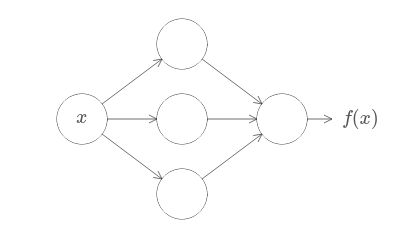
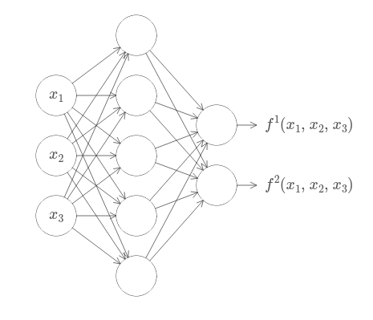
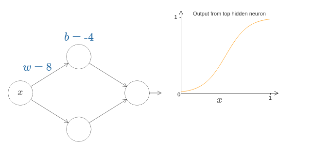
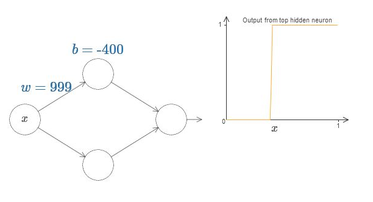
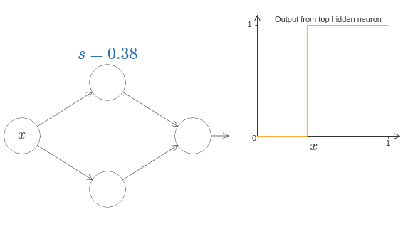
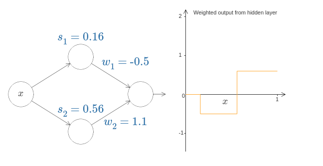
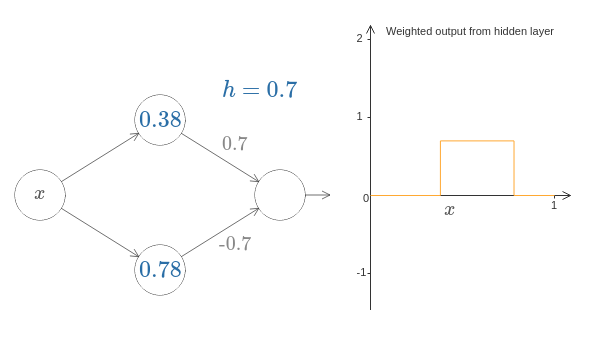
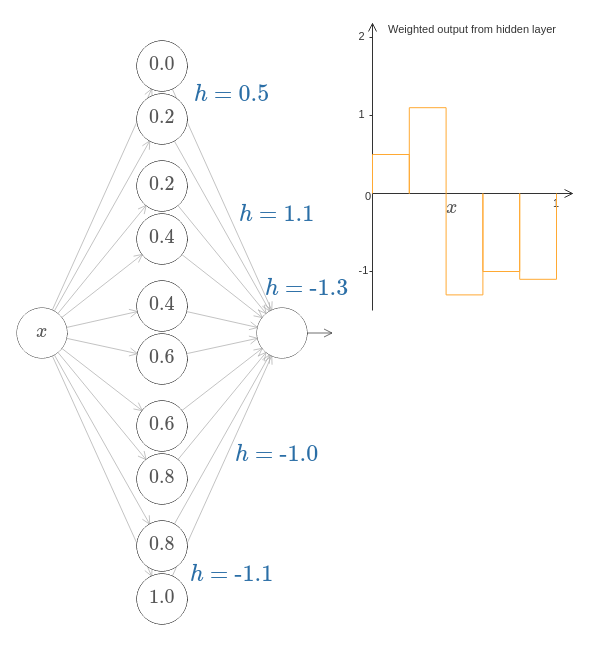
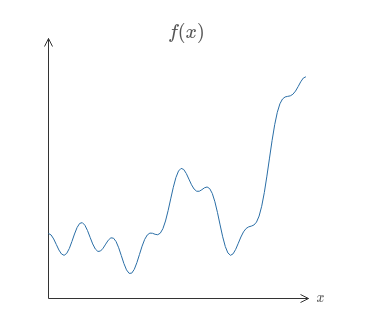
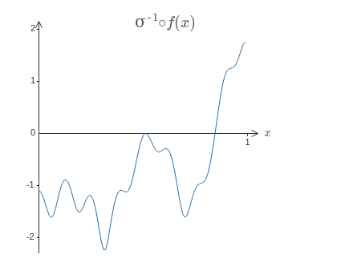

# Chapter 4 - Visual proof that nueral nets can compute any function

- One of the most striking facts is that neural networks can literally compute any function. This means that for every possible input, $x$, the value $f(x)$ (or some close approximation) can be anb output from a network. E.g.:

- This hold for multi variable functions as well $f = f(x_1, ..., x_m)$ . The example below is for $m = 3$ and $n = 2$

  

- This tells us the neural networks have a kind of universality - no matter what function we want to compute, there is a neural network which can do the job
  - This universality theorem holds even if we restrict our networks to have just a single layer intermediate between the input and the output neuron (a single hidden layer). So even simple networks can turn out to be powerful
  - Universality theorems are a commonplace in computer science: the ability to compute an arbitrary function is truly remarkable.
  - This says that a function such as translating English to Chinese can be computed in principle - that <u>does not mean</u> we have good techniques for constructing or even recognizing such a network. This limitation also applies to things such as boolean circuits
  - Combination of learning algorithm + universality is none the less an attractive mix

### Two Caveats

There are two caveats to the statement "a neural network can compute any function":

##### 1st: approximation caveat

1. This does not mean that a network can be used to <u>exactly</u> compute any function - rather we can get an *approximation* that is as good as we want. 

   - By increasing the the number of hidden neurons we can improve the approximation

     - For example, if we want to calculate $f(x)$ we can get a better approximation using 5 hidden neurons rather than 3 (or more)

   - Suppose we want to compute $f(x)$ with a desired accuracy $\epsilon > 0$

     - The guarantee is that we can find a network whose output $g(x)$ satisfied the following for all inputs $x$:

       
       $$
       |g(x) - f(x)| < \epsilon
       $$
       

##### 2nd: Continuity caveat

2. The class of functions which can be approximated this way *must be continuous*
   - If function is discontinuous, then in general it won't be possible to approximate using neural nets
   - Note: even if discontinuous, a continuous approximation might be good enough

**Bottom line:** a more precise statement of the universality theorem is that neural networks with a single hidden layer can be used to approximate any continuous function to any desired precision

### Universality with one input and one output

- For our intuitive proof of universality, we will analyze this graph above with out graphs and biases which together compose the $\sigma(z)$ function output

  - For the *bias* we notice the following:
    - If we decrease the bias, the graph move to the right (hence it becomes more difficult for a high activation)
    - If we increase the bias the graph moves to the left (hence it is easy for the output to be a high activation)
    - General note: the bias *does not change* the shape of the graph
  - For weights we notice the following:
    - If the magnitude of the weight is low, our curve flattens out
    - If the magnitude of the weight is high, out curve becomes very sharp (for very high it mimics a step function)

- To simplify our analysis we will turn this small network into a step function:

  

  - Its simpler to think in this terms of steps function since out output neuron will a bunch of step functions (either 1's or 0's)

  - <u>When does the step occur?</u> With some insight we realize that the step is **proportional** to $b$ and **inversely proportional** to $w$:
    $$
    s = \frac{-b}{w}
    $$
  
- This means the step occurs when $w \cdot s+b = 0$!

- It will greatly simplify our lives to describe the hidden neurons using just the single parameter $s$, which is the step position $s = -b/w$:

  - Below we implicitly set weight $w$ on the input to be some large value (enough for a good step function approximation)
  - Ww can convert a neuron parametrized in this way back to conventional model by choosing a bias $b = -w \cdot s$

  

  

- We can now move a step ahead and see how our network work with this new step-function model:

  - We notice that moving parameter $s_n$ moves the step to the right when increased and to the left when decreased (we remember that parameter $s$ specifies when the step occurs)

  - The weights $w_n$ in the final layer determines the magnitude of the step and on which direction (remember that our output is a 1 after the step and a 0 before the step)

    

  - On the right we have the weighted output $w_1a_1+w_2a_2$ (not the same as $\sigma(w_1a_1+w_2a_2 + b)$)

  - Important to notice that when $s_1$ goes past $s_2$ the role suddenly flip. This happens since we have a situation where the bottom hidden neuron is activated first than the top hidden neurons

  

- Let's us move another step and see what happens when both weights are equal on opposite directions. We can see that we sort of get a bulge which we can control with an external parameter that we might call height
  

  
  
  

- We can expand this notion even further to have numerous peaks with $N$ pairs of hidden neurons. This will particularly divide our interval $[0,1]$ up into $N$ sub intervals

  - It's great to think about them as "after point $s$ add/subtract the amount $h$". If bottom of pair has a lower interval, then it will go negative first
  - Network below we have 5 steps on each $1/5$ points. By changing the output weights (by moving the $h$) we are designing the function

  

  

  

### Actually designing the function with neurons

- So now let's go back to the function we actually wanted to plot. Now we will move on to compute this function in a neural network:

$$
f(x) = 0.2 + 0.4x^2 + 0.3x \sin(15x) + 0.05 \cos(50x)
$$

- Above we have been analyzing the weighted combination:
  $$
  \sum_j w_j a_j
  $$

- But the actual output of the network is the following:
  $$
  \sigma(\sum_j w_ja_j+b)
  $$

  - To control this output the idea is to design a neural network whose hidden layer has a weighted <u>output given by</u> $\sigma^{-1} \circ f(x)$. That is, we want the weighted output from the hidden layer to be:

    

  - If we can do this, the output from the network will be a good approximation to $f(x)^*$. (Note: bias on the output neuron is set to 0 here)

