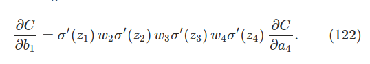

# Chapter 5  - Why are deep neural networks hard to train

- General concept:

  - Let's us say we want to design a circuit to compute... in the design process you will think of splitting between layers that add, another layer of complex tasks with bits, and maybe another circuit for multiplication. You split the problem
  - "Deep circuits" or circuits that simple do this splitting process make the design easier. 
  - In fact, there are mathematical proofs showing that some shallow circuit functions require exponentially more circuit elements to compute than deep circuits
  - "Deep circuits" could then indeed be a more powerful concept to compute

- So far we have approached the problem of number recognition with a very shallow network consisting of only one hidden neuron layer (still to great effect)

  - Intuitively we we'd still expect networks with many more hidden layers to be more powerful

    

  - Such networks could use the intermediate layers to build up multiple layers of abstractions (such as we do with boolean circuits)

  - Theoretical results also suggest that deep neural networks are intrinsically more powerful than shallow networks

- We will still use back propagation, but we will stumble on an issue. Our networks will become very hard to train 

  - When we look below the hood we will notice that the issue is that <u>our different layers are learning at vastly different speeds</u>
  - More specifically, our layer <u>close to output</u> learn way faster than our layers <u>close to input</u>. Early layers tend to get stuck during training  (and the vice-versa case might happen as well!)
  - <u>We'll find that there's an intrinsic instability associated to learning by gradient descent in deep, many-layer neural networks</u>

### The vanishing gradient problem 

- We notice that initially we get a boost in number of correct answers when we had an extra hidden layer of 30 neurons (to be precise a $[784, 30, 30, 10]$ network)

  - The issue is, that the more layers we seem to add, our precision actually decreases! If we look into the top 6 neurons in the two hidden layers in the $[784, 30, 30, 10]$ network, we notice something interesting:

  

  - On average we notice that our gradient $\partial C / \partial b$ is larger on the second hidden layer compared to the first hidden layer!

> Let's look more into this issue of **"vanishing gradient descent"** problem: 
>
> - We denote $\delta^l_j = \partial C/ \partial b^l_j$ as the gradient for the $j^{th}$ in the $l^{th}$ layer. 
>
>   - For example $\delta^1$ may denote a vector whose entries determine how quickly the first hidden layer learns
>
>   - And $\delta^2$ can be the vector determining how quickly the second hidden layer learns
>
> - We will use the length of these vectors for a (rough) measure of the speed at which the layers are learning
>   - For instance, the length $|| \delta^1 ||$ measure speed at which first hidden layer learns
>   - Length $||\delta^2||$ measures the speed at which the second layer is learning
> - For the above example we see that $||\delta^1|| = 0.07$ and $||\delta^2|| = 0.31$ which confirms our initial worries on the learning slowdown of earlier layers. 
>   - This phenomenon gets worse the more layers we add
> - Below we can see what happens if we extend this experiment further. This uses 1,000 training images over 500 epochs and full batches (no mini-batch)
>   - **Note:** the mini batch would add more noise, with similar effects (because its a sample)
>
> 
>
> - The problem is exacerbated with three hidden layers:
>
>   
>
>   
>
> - With four hidden layers our early 1st hidden layer is learning almost 100 times slower than our last hidden layer
>
>   

- What can we conclude in the with the above observations?\
  - Generally in deep neural networks, the gradient is **unstable** tending to either explode or vanish in earlier layer
  - Another pointer. In math for function $f(x)$, if our derivative $f^{\prime}(x)$ is small we can suppose we are close to an extremum (or minimum) of a function which is generally a very good sign - especially in gradient descent
    - But this is not the case here since we randomly chose weights and biases
    - This means that even though our first layers don't change much, it does not mean that they should remain how they are (even though their gradients are smaller in magnitude)!

### What causes the vanishing gradient problem? Unstable gradients in deep neural nets

- Why does the above phenomenon happen? Let's look a bit further into a simple network to analyze this problem:

  

  - As a reminder, the output $a_j$ from the $j^{th}$ neuron is $\sigma(z_j)$ , where $z_j = w_ja_{j-1}+b_j$

> Now let's move forwards and actually study the gradients of this simple network. We will specifically have a look at the expression for $\partial C/ \partial b_1$:
>
> 
>
> - Now let's think about how $\Delta b_1$ causes the output $a_1$ from the first hidden neuron to change. We have:
>   $$
>   a_1 = \sigma(z_1) = \sigma(w_1 a_0 + b_1)
>   $$
>   
>
>   This means that:
>   $$
>   \begin{gather}
>   \Delta a_1 \approx \frac{\partial \sigma(w_1a_0 + b_1)}{\partial b_1} \Delta b_1 \\\\
>    = \sigma^{ \prime}(z_1) \Delta b_1
>   \end{gather}
>   $$
>   
>
>   - Intuitively, this term converts a change $\Delta b_1$ in the bias into a change in the $\Delta a_1$ in the output activation
>
>   - That change in $\Delta a_1$ in turn causes a change in the weighted input $z_2 = w_2 a_1 + b_2$ to the second hidden neuron:
>     $$
>     \begin{gather}
>     \Delta z_2 \approx \frac{\partial z_2}{\partial a_1} \partial a_1 \\\\
>     = w_2 \Delta a_1
>     \end{gather}
>     $$
>
>   - From this we can appreciate how combining our expression for $\Delta z_2$ and $\Delta a_1$, we see how the change in the bias $b_1$ propagates along the network to affect $z_2$:
>     $$
>     \Delta z_2 \approx \sigma^{\prime}(z_1) w_2 \Delta b_1
>     $$
>
> - We can keep doing this until we derive the change in costs $\Delta C$ as follows:
>
>   
>
>   - Dividing by the $\Delta b_1$ we get our final expression:
>
>     
>
> 

**Vanishing gradient problem**

- Let's look at our full gradient expression:

  

- Except the very last term, this expression is a product of terms of the form $w_j \sigma^{\prime}(z_j)$. Let's look at its behavior with the graph of the derivative of the sigmoid function:

  

  

  - Derivative reaches it maximum at $\sigma^{\prime}(0) = \frac{1}{4}$
  - If we choose the weights using Gaussian with mean 0 and standard deviation 1 the weights in our network will *usually* satisfy $w_j < 1$
  - Similarly, we then see that the terms $w_j \sigma^{\prime}(z_j)$ will *usually* satisfy $|w_j \sigma^{\prime}(z_j)| < \frac{1}{4}$. When we take the product of many of these terms, the product will tend to <u>exponentially decrease: the more terms, the smaller the product will be</u>
    - *So statistically*, it shows that our earlier layers will have to learn slowly!
    - In our previous example we had 3 terms that were $w_j \sigma^{\prime}(z_j)$. This means that our $\partial C / \partial b_1$ could be somewhere in the range of $\frac{1}{64} \times \sigma^{\prime}(z_1) \times \partial C/ \partial a_4$. That is already looking like quite a small number

- **NOTE:** this happens when the weights are usually between $|w_j| < 1$. If the weights are big, or grow a lot during training then we have the opposite: the <u>exploding gradient problem</u>:

  - Instead of the gradient vanishing, we'll have an **exploding gradient problem** since the gradeint will grow exponentially

**Exploding Gradient problem**

- This is a contrived example but it really shows well the situation in which we face the exploding gradient problem
- Let's say our network ends up with (or we set) the weights of our network to be large, say $w_1 = w_2 = w_3 = w_4 = 100$, and 
- We set biases so that the $\sigma'(z_j)$ terms are not too small.
  -  Not hard, simply set biases so that each neuron is $z_j = 0$ (hence $\sigma'(z_j) = 1/4$)
  - For instance if we have $z_1 = w_1 a_0 + b_1 = 0$ we can get 0 by setting $b_1 = -100 \times a_0$
- When we do this we notice that all terms $w_j \sigma^{\prime}(z_j)$ are equal to $100 \times \frac{1}{4}$ = 25
  - We can easily see that this gradient grows exponentially!

**Unstable Gradient Problem**

- Fundamental problem here is neither the exploding or vanishing gradient problem - it's that the gradient in early layers i<u>s the product of terms from all the later layers</u>
- The only way all layers can learn at close to the same speed is if all those products of terms come close to balancing out
- As a result, if we use standard gradient-based learning techniques =, different layers in the network will tend to learn at wildly different speed

**The prevalence of the vanishing gradient problem**

- We can see how the gradient can either explode or banish in the early layers of the deep network. Particularly, when using sigmoid neurons the gradient will <u>usually vanish</u> 
- To see why it usually vanished, consider the expression $|w \sigma^{\prime}(z)|$. To avoid the vanishing gradient problem we need $|w \sigma^{\prime}(z)| \ge 1$
  - What happens if you try to solve this by increasing $w$?
    - Well, $\sigma^{\prime}(z)$ also depends on $w$. If we make $w$ large, we have to be careful with making the $\sigma^{\prime}(wa +b)$ simultaneously small, unless the activation is a very specific value
  - Only way to avoid this is if the input activation falls within a fairly narrow range of values

### Unstable gradients in more complex networks 

- We have been looking at very simple networks, but what happens in more complex networks?

  

  

  - $\sum^{\prime}(z^l)$ is a diagonal matrix whose entries are $\sigma^{\prime}(z)$ values for the weighted inputs in the $l^{th}$ layer
  - The $w^l$ are the weight matrices for the different layers
  - $\nabla_aC$ is the vector of partial derivatives of $C$ with respects to the output activations

- This is still the same as above but with a greater amount of values representing the networks
  - Lots of pairs of form $(w^j) \sum^{\prime}(z^j)$
  - The matrices $\sum^{\prime}(z^j)$ have small entries on the diagonal none larger than $1/4$
  - Provided the $w$ isn't to large, each additional term $(w^j)^T \sum^{\prime}(z^j)$ tends to make the gradient vector smaller, leading to a *vanishing gradient*
  - Large number of terms in the product tend to lead to an unstable gradient

___

- In this chapter we have mainly focused in the issue of gradient-based learning in deep networks, but it's not the only one
  - Glorot and Bengio found evidence suggesting that the use of sigmoid activation functions will cause activations in the final hidden layer to saturate near 0 early in training - hence slowing down learning (problem focus on activation functions)
  - Sutskever, Martens, Dahl and Hinton studied the impact on random weight initialization and momentum schedule in momentum-based stochastic gradient descent (the way weights are initializd and how learning by gradient descent is implemented) 