# Chapter 6 - Deep Learning

- We will now look into the basic concepts that help deep neural networks do their work

[TOC]

### Introducing the convolutional networks

- Our earlier networks worked pretty well but it has some strange designs that have to be addressed:
  - It's strange to use networks with fully-connected layers to classify images 
    - Such network architecture does not take into consideration the spatial structure of images
    - For instance, it t<u>reats an input pixel which are part apart and close together on exactly the same footing</u>
    - For that reason such concepts of spatial structure <u>must be instead inferred from the training data</u>
- What if we used an architecture which tries to take advantage of the spatial structure? This design we know of as **convolutional neural network**
  - Network uses a special architecture which is particularly well-adapted to classify images
  - This make them easy to train, hence it helps us train deep, many-layer networks, which classify images effectively - **CNN** are used in most neural networks for image recognition (or some other variant of it) 

- Convolutional neural networks use three basic ideas:
  1. **Local receptive fields**
  2. **Shared weights**
  3. **Pooling**

##### Local Receptive Fields

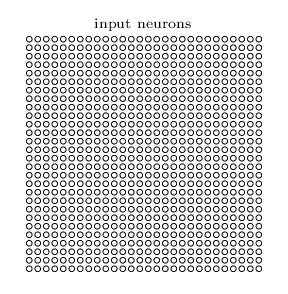

- In convolutional net, it's better to think of the inputs as 28x28 square of neurons

  - As per usual, we will connect the input pixel to every hidden neuron, but we *won't* connect every input pixel to every hidden neuron 
  - Instead <u>we only make connection in small, localized regions</u> of the input image

- To be more precise, each neuron in the first hidden layer will be connected to a small region of the input neurons 

  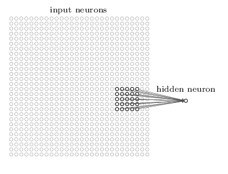

  - Say, for example a 5x5 region corresponding to 25 input pixels like in the image above
  - We call that the **local receptive fields** for the hidden neuron (like a little window on the input pixels)
    - Each connection still learns a weight and an overall bias. So it analyzes the particular local **receptive fields**

- It's important to realize the the neurons input with **receptive fields** is like a *sliding window.* We slowly move a row at a time, and that becomes the next input

  - Below we can see how we *build* this first hidden layer
  - Note that from this process we will derive 24x24 neurons in the hidden layer
  - This is because it can move 23 times across and 23 times down
  - Or better, takes 24 local receptive fields accross and 24 local receptive fields down

  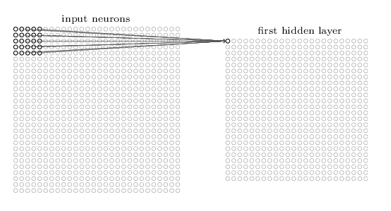

  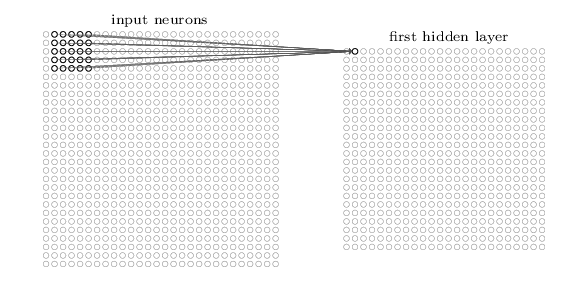

  

- The local receptive field can move one pixel at a time, or maybe 2 pixels at a time (right or down). In this case we'd say a <u>stride length of 2</u> is used. We'll stick with stride length of 1 throughout

##### Shared weights and biases

- Each hidden neuron has a bias and a 5 x 5 weight matrix connected to its local receptive field.
- More importantly: <u>we are going to use the *same* weights and bias</u> for each of the 24 x 24 hidden neurons

> - In other words, for the $j$ and $k^{th}$ hidden neuron the output is:
>
>   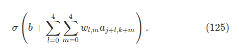
>
>   - The $\sigma$ is our activation function
>
>   - $b$ is the shared value for the bias
>
>   - $w_{l,m}$ is a $5 \times 5$ array of shared weights
>
>   - $a_{x, y}$ denotes the input activation at position $x, \space y$. ($j$ and $m$ determine where the local receptive fields is at currently)
>
>   - This would be a small example for the case where the receptive field is at the beginning 
>
>     $\sigma(b + w_{0,0}a_{0,0} + w_{0,1}a_{0,1} ... + w_{4,4}a_{4,4})$
>
> - This means that <u>all the neurons in the first hidden layer detect exactly the same *'feature*'</u>, or are affected together basically (an *input pattern*, informally)
>
>   - To see why, suppose the weights and bias are such that the hidden neurons can pick up a vertical edge in a particular local receptive field. This is also useful in other places in the image
>   - So we can use this same *feature detector* everywhere in the image
>
> - In more abstract terms: <u>convolution networks are well adapted to the translation invariance of images</u>
>
>   - Move a picture of a cat a little way, and it's still an image of a cat
>   - With CNN we can pick this common edges and corners in images (even when they are translated in the image)
>
> - For this reason we may call the map from the input layer to the hidden layer a ***feature map***
>
>   - We call the weights defining the feature map the **shared weights**
>   - We call the bias defining the feature map the **shared bias**
>   - The shared weights and bias are often said to define a **kernel** or filter
>
> 

- The network layer seen so far can detect just a single kind of localized feature. To do image recognition we'll need more than one feature map:

  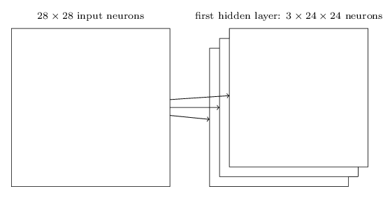

  - A complete constitutional layer consists of several different feature maps (as seen above)
  - Each of the maps is defined by a 5 x 5 shared weight and a single shared bias, hence the network can detect 3 different kind of features
  - In practice we may deploy more way more feature maps (this here is for simplicity)

- In our example we will work with constitutional layers with 20 and 40 feature maps. We can see below some of the feature maps/kernels that we learn:

  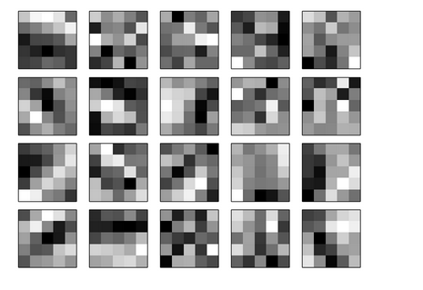

  - Whiter blocks: smaller (typically, more negative) weight, hence our feature map responds less to the corresponding input pixel
  - Darker blocks: larger weights that respond more to input
  - These kernels certainly show our network is learning to recognize certain features related to spatial structure of our network 

- A good reason to used shared weights and biases is that it greatly reduces the number of parameters involved in a convolutional network

  - For each map we need 25 shared weights (5 x 5) and a single shared bias
  - That means each feature map requires 26 parameters. If we have 20 features that is 520 parameters
    - The fully-connected layer uses around 23,550 parameters! (40 times the convolutional one)
  
- <u>Why is is called covolutional?</u>

  - The equation we saw above (125) is sometimes known as a convolution
  - More precisely we write equation $a^1 = \sigma(b + w * a^0)$
    - $a^1$ denotes the set of output activations from one feature map
    - $a^0$ is the set of input activations
    - $*$ is known as the **convolutional  operator** 

  

##### Pooling Layers

- In addition to the convolutional layers just described, convolutional networks also contain **pooling layer**
- Pooling layers are usually used after convolutional layers - what it does is simplify the information in the output from the convolutional layer

  - In detail, the pooling layer takes each feature map* (kernel) output from the convolutional layer and prepares a condensed feature map

> - As a concerete example, one common procedure for pooling is **max-pooling**. 
>
>   - In **max-pooling** a *pooling unit* (2 x 2 grid) simply outputs the maximum activation in the input region. Each unit in the pooling layer may summarize a region of (say) 2x2 like below
>
>     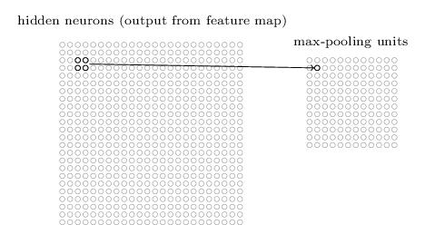
>
>   - Since we have 24 x 24 neruons output from the convolutional layer, after pooling we have 12 x 12 neurons!
>
> - The convolutional layer usually involves more than a single feature map, hence we apply the *max-pooling* to each feature map separately. With 3  feature maps like we had before it will look something like this:
>
>   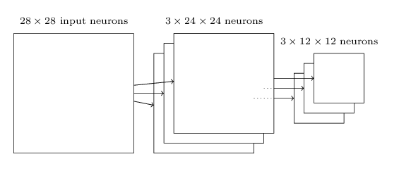
>
>   - We can think of max-pooling as a way for the network to as whether a given feature is anywhere in a region of the image, then throws away the exact position information 

- Intuition is that once a feature has been found, its exact location isn't as important as its rough location relative to other features
  
  - Benefit: since there are many fewer pooled features, this helps reduce the number of parameters needed in later layers
  
- Another option apart from max-pooling is called **L2 pooling**. 
  
  - **L2 Pooling**: instead of taking the maximum activation of a 2x2 region, we take the sqaure root of the sum of squares of the activations in the 2x2 regions 
  - L2 pooling is a way of condensing information from the convolutional layer. Both techniques are widely used. Some methods of pooling can help optimize learning
  
  
##### Putting it all together

- Now we can easily put it together. The model is identical to what we had before, but now with an extra layer of 10 output neurons corresponding to the 10 values of MNIST:

  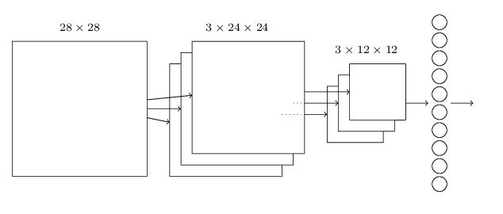

1. Network starts with a (28x28) input neuron layer used to encode the pixel intensities for MNIST image
2. Then its followed by a convolutional layer using a (5x5) local receptive field and 3 feature maps (2 x 24 x 24 layer)
3. Max pooling layer applied to a (2x2) region across each of the 3 feature maps (3 x 12 x 12 hidden feature neurons)
4.  Final layer of connection is a <u>fully connected layer</u> - that is, the layer connects every neuron from the max-pooled layer to every one of the 10 output neurons. 

#### Explanation of Brandon Rohrer Video "How convolutional neural networks work"

https://www.youtube.com/watch?v=FmpDIaiMIeA

- When using a local receptive field with the *kernel* or the *feature map* we do convolution. And we get a nice map of the image of where this feature occurs!
  - With this feature maps, we can spot where the feature occurs in the image regardless of its position
  - The 3x3 grid we see there would be our <u>shared weight</u> for that feature map

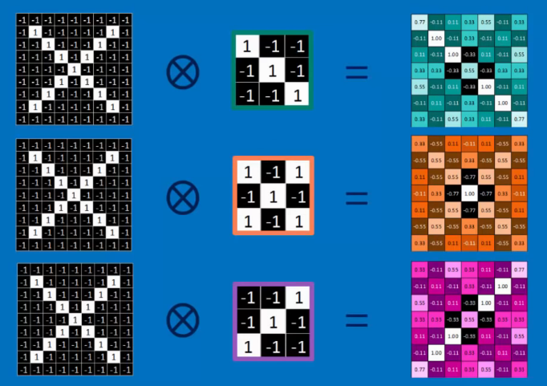

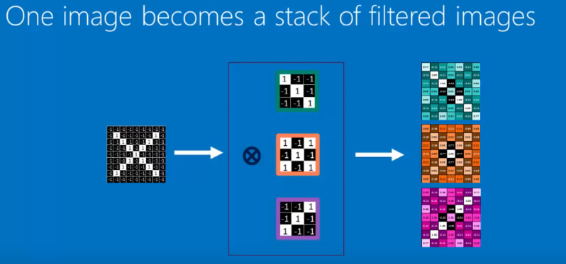

- From creating our feature maps, we move into **pooling.** We use the same pooling procedure we selected above (strides of 2, taking the max value of the 2x2 grid)

  - We end up with a similar pattern but smaller! Our high values are still in the diagonal

  - Pooling doesn't care where the maximum value occurs, so makes it less sensitive to position

    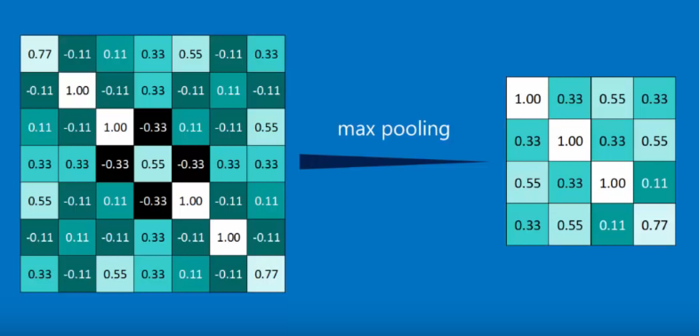

  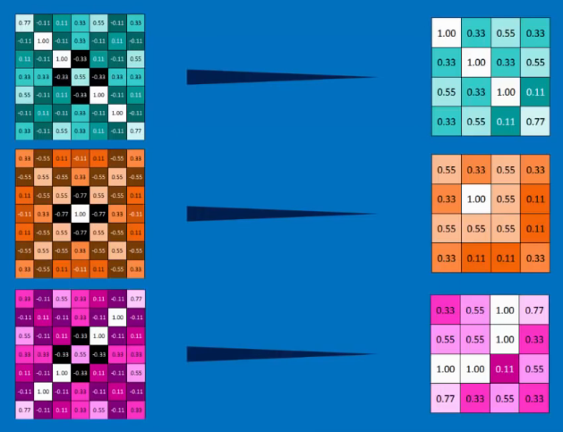

- Then the final step is connecting the pooling layer with our fully-connected layer

  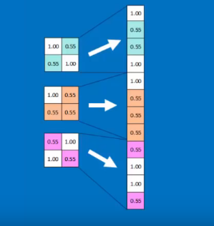

  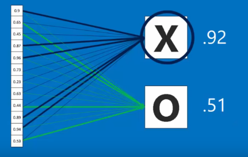

### Backprop in CNN

- We will be working with this simple image that is 3x3, and a convolutional layer that has a weight matrix 2x2 big. Then we pass its activations through the polling layer

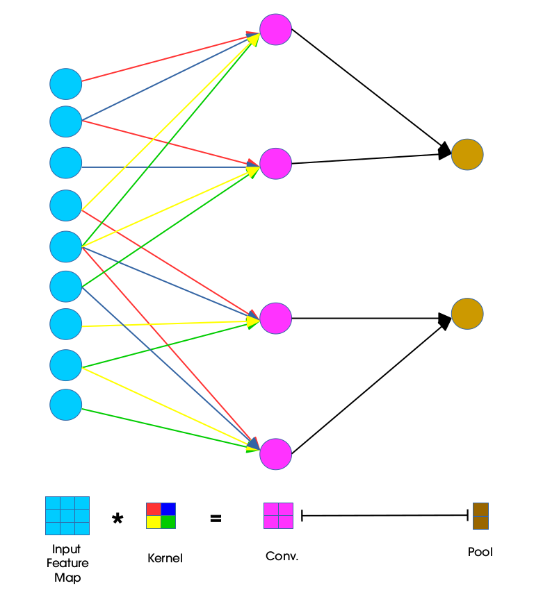

### CNN In practice 

- Look into the code, we have all important networks there

#### Using Rectified linear Units

>  The **ReLU** is defined as follows:
> $$
> f(z) = max(0, z)
> $$
> 

- One way to improve the way our neurons learn is by changing the sigmoid activation function for <u>rectified linear units</u>. 
  - These change in neural activation function consistently outperforms networks based on sigmoid activation functions
- What makes this activation function better than *tanh* or the *sigmoid*?
  - Nobody knows, the reason seems to be more empirical rather than hard proof (heuristics)

#### Expanding the training data

- Another way to improve is by algorithmically expand our dataset
  - This we can do by moving the image one pixel up, down or to the side
  - Also it can be achieved by possibly rotating the image slightly
  - "Elastic distortion" by emulating random oscillations hand muscles undergo when a person is writing 
- By running `python expand_mnist.py` we can expand our dataset from 50,000 images to 250,000 training images

#### Inserting an extra fully-connected layer

- In the book the author goes on and adds an extra layer of fully connected neurons with 100 neurons.
  - This did improve performance but in a very slight insignificant way
- How can we proceed to reduce over-fitting then?
  - What worked quite well was the *dropout technique* to make all of our fully neurons more robust  and less affected by small idiosyncrasies 
  - With this (and previous techniques) we moved to a 99.60% accuracy
  - It also allowed to reduce the number of epochs to only 40 since we reduced over fitting
- Note, since dropout removes some neurons its a good idea to add more neurons to the fully connected layers since it omits many of the neurons while training

#### Using an ensemble of networks

- One way to improve performance further is by creating several neural networks, and then get them to vote to determine the best classification

  - Even though the networks would have similar classification accuracy, it could happen that they have different errors each
  - Taking a vote from 5 neural networks might be the best decisions since the majority might agree on one outcome

  

#### Why only apply dropout to fully-connected layers?

- In principle we could apply a similar procedure to our convolutional layers, but there is no need since convolutional layers have <u>considerable inbuilt resistance to over-fitting</u>
  - This is because the shared weight means the convolutional filters are forced to learn across the entire image
  - This makes its less likely that they will pick up on local idiosyncrasies in the training data

#### Why are we able to train (avoid vanishing gradient)?

- Before we saw that in fully connected layers we were suffering from the vanishing/exploding gradient problem. How were we able to avoid that?
  - The genuine answers is that we haven't really avoided that problem

> What has happened is actually the following: 
>
> 1. Using convolution layers greatly reduces the number of parameters in those layers, making the learning problem much, much easier
> 2. Using more powerful regularization technique (dropout and convolutional layers) to reduce overfitting. This is more of a problem in complex networks
> 3. Using **ReLU** instead of sigmoid neurons to speed up training - empirically often by a factor of 3-5
> 4. Using GPU's and willing to train for a longer period of time (experiments were using 40-60 epochs using a larger training set that MNIST)
>    - Factors (3) and (4) makes it as if we trained a factor perhaps 30 times longer than before'
>
> - There is clearly more to it as well:
>   - Using right cost function to avoid learning slowdown
>   - sufficiently large data set
>   - good weight initialization
>   - algorithmically expanding the training data 

### Other approaches to deep neural nets

- In this book we have focused on some of the bigger ideas in neural network research:
  - Stochastic gradient descent
  - backpropagation
  - convolutional nets
  - regularization 
  - Algorithmic expansion of data (and more)
- But in the literature there are other big ideas we haven't touched upon:
  - **Recurrent neural networks (RNNs)**
  - **Boltzmann machines**
  - **Generative models**
  - **Transfer learning**
  - **Reinforcement learning**
  - And more...

#### Recurrent neural networks

- Our networks are very static, since they only feed forwards with no regard to time and space

- But we can change the architecture so that a neuron might not just be determined by the activations in previous hidden layers, but also by the activations at earlier times.

  - Intuition: "To infinity and beyond" makes more sense than "Two infinity and beyond"

    

#### Long short-term memory units (LSTMs):

- Problem with RNN networks is that they are hard to train since they suffer from the vanishing gradient problem as well.

  - In RNN's the problem gets worse since the gradient is not only propagated backwards through layers, but also through time. This makes the gradient very unstable

- Fortunately we can incorporate an idea called long short-term memory units **(LSTMs)** into RNNs

  

#### Deep belief nets, generative models, and Boltzmann machines

- Modern interest in deep learning began in 2006, with *deep beleif networks* (DBN)
  - These networks faded in popularity for feed forward networks and recurrent neural nets
  - Despite this DBNs have interesting properties that make them of interest: 
- DBNs are interesting since they're an example of what we call a *generative model*
  - in a feedforward network, we specify the input activations, and they determine the activations of the feature neurons later in the network
  - A generative model like a DBN can be used in a similar way, but it's also possible to specify the values of some of the feature neurons and then "run the network backward", generating values for the input activations (a.k.a generate an image! Like space)
- More concretely, a DBN trained on images of handwritten digits can (potentially, and with some care) also be used to generate images that look like handwritten digits.
  - Not only can it read digits, it can also write them
- Another cool factor is that they can do unsupervised and semi-supervised learning
  - For instance, when trained with image data, DBNs can learn useful features for understanding other images, even if the training images are unlabelled
    - the ability to do unsupervised learning is extremely interesting both for fundamental scientific reasons, and - if it can be made to work well enough - for practical applications

### Future progress

***Conway's Law***

Any organization that designs a system... will inevitably produce a  design whose structure is a copy of the organization's communication  structure.

- *And so the structure of our knowledge shapes  the social organization of science.  But that social shape in turn  constrains and helps determine what we can discover.* 
  - This is the  scientific analogue of Conway's law. 

